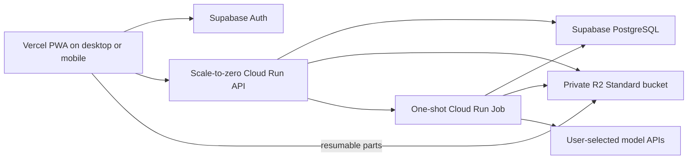

# SubGen Cloud Web App

This branch adds an independent multi-user web application without changing the desktop pipeline. The same account can sign in on a computer, iPhone, iPad, or Android device and see the same settings, uploaded-video history, review drafts, jobs, and artifacts.

## Services And Cost Boundary

Vercel and Supabase are different, complementary services:

- Vercel serves the static installable PWA. No Vercel Function runs the subtitle pipeline.
- Supabase supplies email authentication and PostgreSQL persistence.
- Cloudflare R2 Standard stores private videos and artifacts.
- Google Cloud Run serves the lightweight API and starts one-shot pipeline jobs.

A light personal prototype can fit within these providers' free allowances, but arbitrary video processing cannot be guaranteed to cost zero. Video storage, model calls, container-image storage, outbound traffic, and CPU/GPU processing can exceed free tiers. Google budgets are delayed alerts, not real-time spending caps. The only literal zero-Google-compute guarantee is `SUBGEN_PROCESSING_ENABLED=false`.

The production defaults therefore fail closed and use:

- Processing disabled until explicitly armed.
- One active job per account and one active job globally.
- One job globally per rolling 24 hours, four per account and six globally per rolling 30 days.
- A 512 MiB upload limit, 20-minute input limit, and two-day artifact retention.
- One worker task, no parallelism, no retry, and automatic exit after one stage.
- CPU-only processing; GPU is disabled.
- A billed-cost budget notification that deletes the worker job as an emergency stop.

The user's Google, OpenAI, Cohere, xAI, Anthropic, or other model calls still use the user's own provider account and its billing terms. SubGen never proxies these calls through a shared paid model account.

## Architecture



Provider API keys are encrypted with AES-256-GCM. The encryption master key belongs in Google Secret Manager, never in Git, the browser, PostgreSQL, logs, or an image. Database and storage access is scoped by the authenticated user's internal ID.

Supabase asymmetric access tokens are verified against its JWKS endpoint. Legacy `HS256` sessions are verified through Supabase Auth's `/user` endpoint; the shared JWT secret is not copied into SubGen.

## Local Verification

```powershell
pip install -e ".[cloud]"
$env:SUBGEN_DEV_AUTH="true"
$env:SUBGEN_PUBLIC_BASE_URL="http://localhost:8000"
uvicorn subgen_cloud.api:create_app --factory --host 127.0.0.1 --port 8000
```

Or build the API and continuous local worker with Compose:

```powershell
docker compose -f cloud/compose.yaml --profile worker up --build
```

The production worker image defaults to `--once`; Compose explicitly overrides that command for local polling.

## Production Setup

1. Use a dedicated Google Cloud project so the emergency stop cannot affect unrelated services.
2. In Supabase, enable email magic links and collect the project reference, anon key, and pooled PostgreSQL URL. Add the final Vercel origin to Auth redirect URLs.
3. In R2, keep the bucket in Standard storage, create an S3 API token scoped only to that bucket, apply `cloud/r2-cors.json` after replacing the Vercel origin, and add a lifecycle rule deleting `users/` objects after two days.
4. In Google Cloud Shell, clone this repository and branch and run `cloud/gcp/deploy.sh` with `ARM_PROCESSING=false`.
5. Run `cloud/gcp/install-cost-kill-switch.sh` before arming processing.
6. Import the repository into Vercel. Set `SUBGEN_API_BASE_URL` to the printed Cloud Run API URL. The build is static and contains no private credential.
7. Test sign-in, upload, existing-video recognition, and cached output reuse. Then rerun deployment with `ARM_PROCESSING=true SKIP_BUILD=true` when you accept the free-tier caveat.

Do not paste secrets into chat or commit them. Set only these non-secret identifiers in Cloud Shell:

```bash
export PROJECT_ID="your-dedicated-google-project"
export REGION="europe-west1"
export SUPABASE_PROJECT_REF="your-project-ref"
export R2_ACCOUNT_ID="your-cloudflare-account-id"
export R2_BUCKET="your-standard-bucket-name"
export VERCEL_ORIGIN="https://your-project.vercel.app"
export ARM_PROCESSING="false"
bash cloud/gcp/deploy.sh
```

The deploy script reads secret values without terminal echo and writes them directly to Secret Manager. It prints the Cloud Run API URL required by Vercel.

Install the emergency stop in the same private Cloud Shell session:

```bash
export BILLING_ACCOUNT_ID="your-billing-account-id"
export BUDGET_AMOUNT="0.01USD"
bash cloud/gcp/install-cost-kill-switch.sh
```

Budget reporting can be delayed, so this greatly limits risk but cannot mathematically guarantee a zero charge. Vercel Hobby itself cannot purchase overage, and the app uses no Vercel Functions. Supabase should remain on Free, and R2 must remain Standard because only Standard receives R2's included free usage.

## Failure Behavior

The API rejects new transcription and burn work while processing is disabled. Compatible completed outputs can still be reused and downloaded. If the worker cannot be dispatched, the job is marked failed instead of remaining queued forever. The worker processes one queued stage and exits, and the Cloud Run job has no automatic retry.
